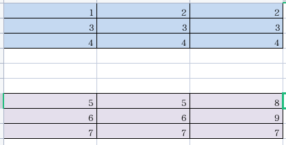

# fatopia-seats

## windows运行

- 安装 `python3.11` 或以上
- 安装依赖库: `pip install -r requirements.txt`
- `python widget.py`


## 需求描述

- 需求文档： https://v3lhpbwdje.feishu.cn/docx/RWKndBLQzo3gRAxcKHAcC00hnBc


### 数据

> TODO: 会员码优先购


- 门票信息： `[订单ID, 区域, 排, 座位号, 票数量, 票型, 订单时间, 付款时间]`

    ```
    例如:

    [110, A, 01, Platinum Seated, 1701138372, 1702138372]
    ```

- 排序层次: `全场 >> 区域 >> 排 >> 座位`

    ```
    例如：

    区域排序： 110, 111, 112, 113

    排排序：A, B, C, D, E

    座位排序： 1, 2, 3, 4, 5
    ```

- 票档和区域关系
  - 票型`1-n`区域
  - ~~区域`n-n`票型？？~~
    - 这种多对多，简化成上面票档`1-n`区域
    - 一个区域内有特殊区域的，**视作不同区域**


### 分配规则

- 时间顺序（可配置）:
  - 方案1: 按照**订单创建时间**
  - 方案2: 按照**实际付款时间**
  - TODO方案3： 会员购 & 公售

- 同一订单座位必须连座
  - 连座：对于X个座位的订单，需要在**同一排** && 最大座位号和最小座位号相差X-1

- 为了保证连座，可以打乱顺序，但需要尽量减少影响，在以下两个方法中择优
  - 方法1：跟之前的换
  - 方法2：找下一个适合的
- 择优：更换后的排序与原订单排序相差最小


## 示例1：

## 输入

区域座位数据:

```
110, 111      // 区域，已排序

A, B, C       // 排， 已排序

1, 2, 3       // 座位(列)， 已排序
```

票档和区域映射：

```
110, VIP
111, VIP

```


订单数据:

- `[订单ID, 票数量, 票型, 订单时间, 付款时间]`


```
1, 1, VIP, 12331, 12339
2, 2, VIP, 12341, 12349
3, 3, VIP, 12351, 12359
4, 3, VIP, 12361, 12369
5, 2, VIP, 12371, 12379
6, 2, VIP, 12381, 12389
7, 3, VIP, 12391, 12399
8, 1, VIP, 12491, 12499
9, 1, VIP, 12591, 12599

```


## 输出




- `[订单ID, 区域， 排， 座位]`

```
1, 110, A, 1
2, 110, A, 2
2, 110, A, 3

3, 110, B, 1
3, 110, B, 2
3, 110, B, 3

4, 110, C, 1
4, 110, C, 2
4, 110, C, 3

5, 111, A, 1
5, 111, A, 2
8, 111, A, 3

6, 111, B, 1
6, 111, B, 2
9, 111, B, 3

7, 111, C, 1
7, 111, C, 2
7, 111, C, 3
```


## 算法设计

- 优先级定义： `连座优先级 > 时间优先级`
